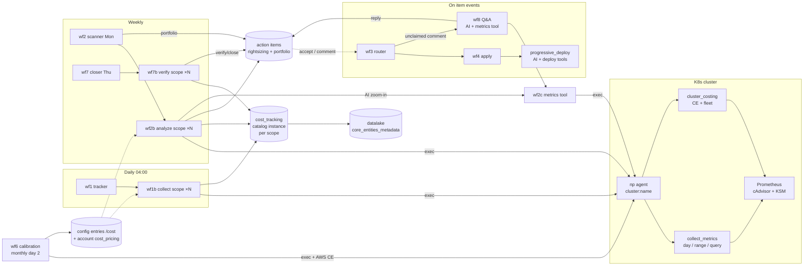
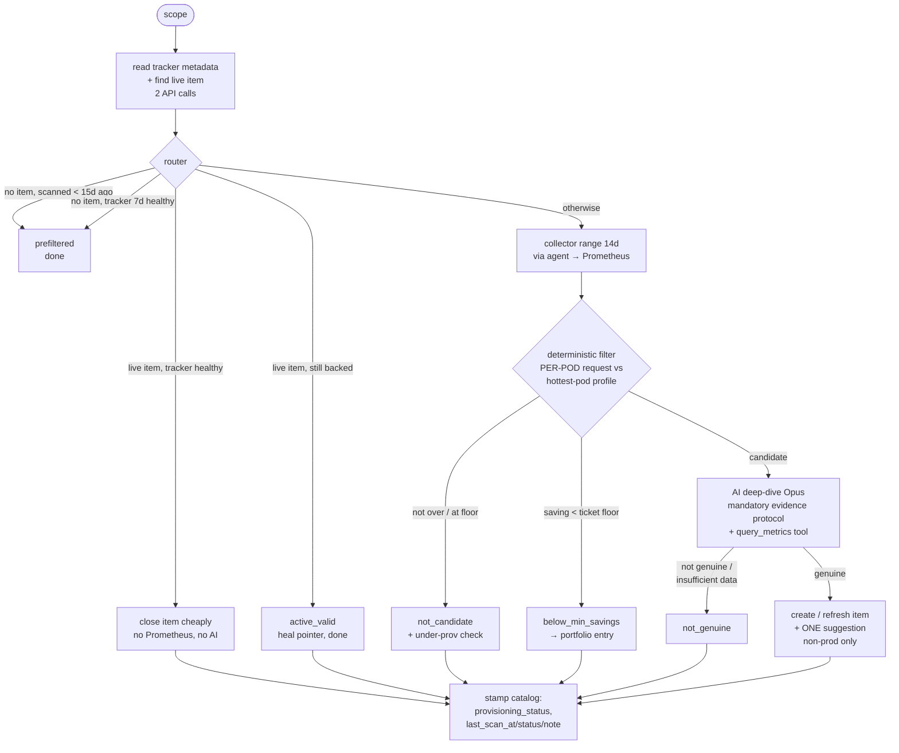
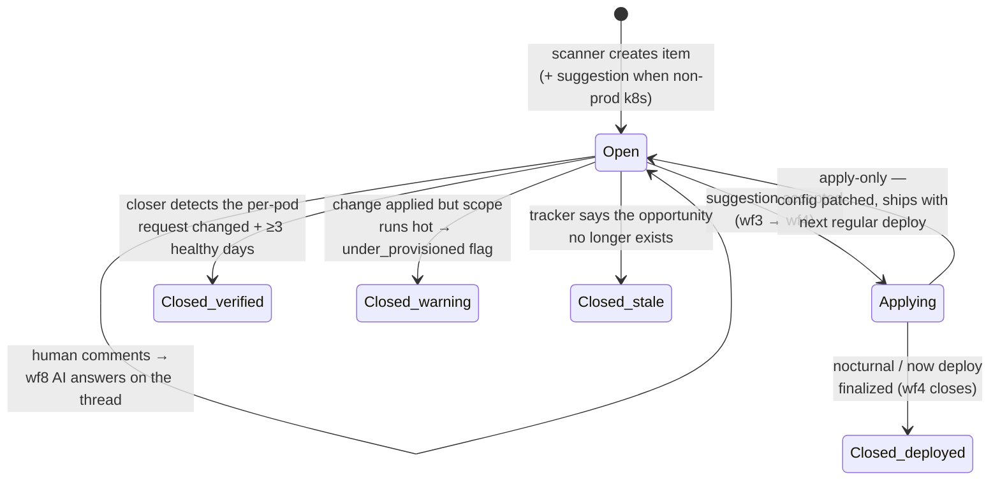

# Cost & Right-Sizing — Architecture

How the pieces fit together, what data flows where, and the lifecycle every
opportunity goes through. For the WHY behind each design choice, see
[decisions.md](./decisions.md). For setup, see the [README](../README.md).

## The big picture

Three loops run at different cadences over the same data spine (the
`cost_tracking` catalog instance on each scope, mirrored to the datalake):

- **Daily** (tracker): measure and price what every scope used and reserved.
- **Weekly** (scanner + closer): turn waste into action items, verify what
  got acted on, close the loop.
- **Monthly** (calibration): re-derive unit prices from the real AWS bill.

## The data spine: one instance per scope

Everything meets on the scope's `cost_tracking` metadata instance:

| Owner | Fields |
|---|---|
| **Tracker** (wf1b, daily) | `cost_today` / `usage_cost_today` / `waste_today`, rollups (`cost_7d/30d/365d`), sizing snapshot (requests, usage, utilization, pods envelope, 10m peaks), `daily_series` (365-day FIFO — usage, requests, pods, peak profile, cost per day) |
| **Scanner** (wf2b) | `provisioning_status` (chip), `rightsizing_item_id` (the closer's work queue), `last_scan_at/status/note/savings` (the verdict, human-readable) |
| **Closer** (wf7b) | flips `provisioning_status` on verified outcomes, clears stale pointers, stamps its notes |

The tracker only ever PRESERVES scanner-owned fields; the scanner never
touches cost fields. The lake mirrors the whole instance within seconds, so
dashboards read the lake, never Prometheus.

**Two resolutions, on purpose**: Prometheus keeps the fine grain (~13 days
at scrape resolution) and answers every live zoom-in; the daily series
keeps the SHAPE (per-day peaks/p95/valley/peak-hour + pods envelope) for
365 days. Nothing per-minute is ever stored in the catalog.

## The scan decision tree (wf2b)

Cheap first, expensive last. Two API reads route most scopes without
touching Prometheus; the AI only runs on candidates that survived a
deterministic filter, and its verdict is evidence-bound.

Every conclusive verdict stamps `last_scan_*` — that stamp IS the 15-day
rescan window, and `last_scan_note` answers "why is/isn't there a ticket
here?" straight from the scope page.

## Item lifecycle

Three different closers, by design: **wf4** closes what it deployed itself,
the **closer** closes what shipped through regular deploys or manual edits
(commenting the REALIZED saving), and the **scanner** closes what stopped
being true. `no_data` and "insufficient history" never close anything —
unmonitored is not fixed.

## The iron rule: per-pod, always

Every sizing comparison in the system runs on PER-POD numbers:

- requests are per-pod **config** — only a spec change moves them;
- fleet totals (Σ across pods) move with the autoscaler — a 4→5 scale-up
  looks like "+25% request" on fleet numbers and is pure noise.

This rule was learned the hard way, twice in one day (see
[decisions.md](./decisions.md#d9)): the closer wrongly closed 3 items on an
autoscaling event, and the deterministic filter rejected the top candidate
because fleet peaks tracked replica count. The collector therefore exports
the per-pod request straight from KSM (`per_pod.req_cpu_mc`) and the
hottest pod's profile (`hot_p95_10m_mc`, `hot_peak_mb`); fleet sums exist
only for pricing, where they are correct.

## Money flow

- **Chargeback** (what a scope costs): per hour, `max(used, requested)` —
  reservations bind cluster nodes whether used or not. Shown to developers
  as their spend; the gap vs `usage_cost` is their waste.
- **Unit prices**: derived monthly from the real bill — AWS Cost Explorer
  **AmortizedCost** (unblended lies under Savings Plans: we measured a ~7×
  understatement) split ~7.2:1 vCPU:GB over the fleet's allocatable
  resources. Guardrailed to [⅓×, 3×] per calibration.
- **Savings math**: per-pod reclaim × average replicas × price × 730 h.
- The bill − Σ scope chargeback = platform overhead (nodes the bin-packing
  and system components consume). With Karpenter, freed requests become
  fewer nodes, so realized right-sizing shrinks that overhead too.
